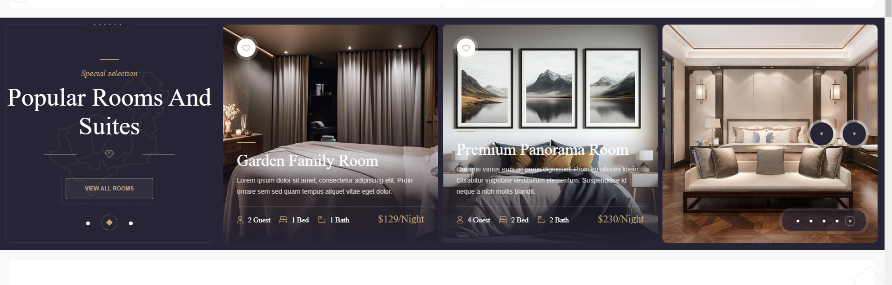

# Hotel Website Template

A modern, responsive one-page hotel website template built using HTML, CSS, and JavaScript. This template provides essential information about a hotel, including available rooms, amenities, and other details. It is also integrated with Booking.com for direct reservations.

## Features
- **One-Page Design**: Seamless and elegant layout for an engaging user experience.
- **Hotel Room Information**: Displays details about different room types and amenities.
- **Responsive Layout**: Fully optimized for desktop, tablet, and mobile devices.
- **Smooth Animations**: Subtle animations and transitions for a modern look.
- **Booking.com Integration**: Direct link to Booking.com for easy reservations.

## Screenshots
Below are some previews of the hotel website template:





## Technologies Used
- **HTML** – Structure of the website
- **CSS** – Styling and layout
- **JavaScript** – Interactive elements and animations

## Installation & Usage
1. Clone the repository:
   ```bash
   git clone https://github.com/uvindu94/hotel_html.git
   ```
2. Open the project folder and launch `index.html` in a web browser.

## Contributions
Contributions are welcome! Feel free to fork the repository and submit a pull request with any improvements.

## License
This project is licensed under the MIT License. See the `LICENSE` file for details.

## Contact
For any inquiries or suggestions, feel free to reach out!

---
⭐ **Don't forget to star this repository if you find it useful!** ⭐
